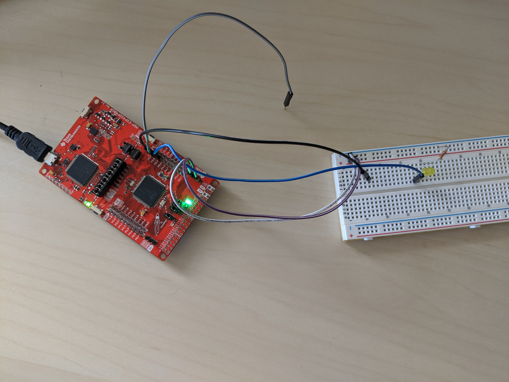

## Lab 4 - Annunciator

The objective of this lab was to create an annunciator system for a syrup factory. The requirements are detailed in "Lab4_Annunciator.pdf"

### Experimental Setup
The system was constructed on an MSP432 and a breadboard. See below for the setup:

### Technical Implementation
The underlying state machine was given in the lab document and is shown below:

